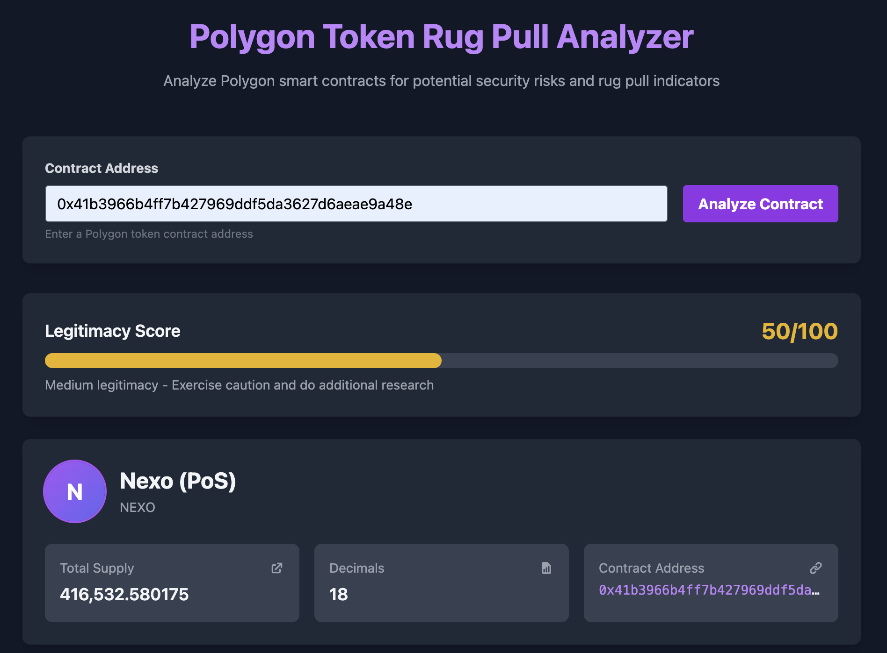

# Polygon Anti-Rug Checker

A web application to analyze Polygon smart contracts for potential rug pull risks.

## Live Demo

[**Try the live application here**](https://polygon-anti-rug.onrender.com/)



## Features

- Input any Polygon contract address for analysis
- Checks for common rug pull patterns
- Analyzes contract ownership and permissions
- Provides risk assessment with detailed explanations
- Modern, user-friendly interface with Polygon branding

## Setup

1. Install dependencies:
```bash
npm install
```

2. Configure environment variables:
   - Create a `.env` file in the root directory
   - Add your Polygonscan API key: `POLYGONSCAN_API_KEY=your_key_here`
   - Add your DeepSeek API key: `DEEPSEEK_API_KEY=your_key_here`
   - You can use the default RPC provider or specify your own: `PROVIDER_URL=your_rpc_url`

3. Build the CSS:
```bash
npm run build:css
```

4. Start the server:
```bash
npm start
```

5. Open your browser and navigate to `http://localhost:3000`

## How it Works

The application analyzes Polygon smart contracts for several risk factors:

1. Token distribution analysis
   - Top holder concentration
   - Distribution patterns
   - Gini coefficient

2. Transaction pattern analysis
   - Recent transaction volumes
   - Suspicious trading patterns
   - Large transfers

3. Smart contract security
   - Contract ownership and admin privileges
   - Minting capabilities
   - Potential backdoors

4. Risk assessment
   - Detailed risk factors with severity levels
   - Comparison against known rug pull patterns
   - Overall risk score

## Technology Stack

- Frontend: HTML, JavaScript, TailwindCSS
- Backend: Node.js, Express
- Blockchain: Polygon, ethers.js
- API: Polygonscan API
- AI: DeepSeek API for smart contract analysis
